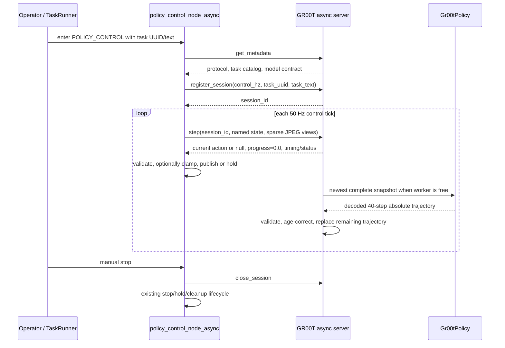

# Semihumanoid GR00T N1.7 Real-Robot Serving Design

**Date:** 2026-08-19

**Status:** Implemented and checkpoint-smoke-tested; live latency, ROS shadow, and motion
gates remain open

**Decision:** Keep the existing ROS2 `policy_control_node_async.py` and add a GR00T-side
async compatibility server that constructs the repository's unchanged `Gr00tPolicy`.

**Related:**
[`2026_0819_semihumanoid_gr00t_model_serving.md`](2026_0819_semihumanoid_gr00t_model_serving.md),
[`2026_0818_semihumanoid_gr00t_conversion_plan.md`](2026_0818_semihumanoid_gr00t_conversion_plan.md)

## Purpose and scope

This document decides how the finetuned semihumanoid GR00T N1.7 policy should connect to
the existing Industrial Next robot stack for real-robot trials. It does not repeat the
checkpoint-loading and native ZeroMQ examples in the existing model-serving guide.
Instead, it compares the two end-to-end integration directions and defines the recommended
robot/server contract.

The two directions are:

1. Run the stock [`run_gr00t_server.py`](../gr00t/eval/run_gr00t_server.py) and implement a
   new GR00T-specific ROS2 policy client.
2. Keep `policy_control_node_async.py` on the robot and implement a GR00T-side server that
   speaks its existing async WebSocket protocol.

The design is source-aligned to these checkouts:

- `/home/ubuntu/Isaac-GR00T`
- `/home/ubuntu/industrialnext_ros2`
- `/home/ubuntu/industrialnext_ai`

The current `flexiv_ube` policy configuration is the concrete pilot target: bilateral
arms and parallel grippers, bilateral F/T state, three RGB cameras, 256x256 policy images,
50 Hz control, rot6d observations/actions, async serving on port 10012, and manual task
selection through the shared task catalog.

This design review itself loaded no model and sent no robot command. At that inspection
time, the checkpoint transfer was incomplete. The later implementation loaded and warmed
the completed root checkpoint on an alternate loopback port without contacting ROS or the
robot; the implementation record is in the related plan.

## Decision summary

Direction 2 is the better first integration and the recommended long-term boundary:

```text
ROS2 robot/application process                GR00T GPU process

policy_control_node_async.py                  GR00T async compatibility server
  - ROS subscriptions                           - async session and action timing
  - task/control lifecycle       WebSocket       - JPEG decode and sparse image cache
  - state trust and hand gates   step RPC         - robot-field <-> model-field adapter
  - command validation/publish  <----------->     - rot6d convention conversion
  - suppression and final hold                   - Gr00tPolicy(strict=True)
  - monitoring heartbeat                         - saved processor + N1.7 checkpoint
  - manual stop
```

This does create a new server entry point, but it does not create a second model-loading or
model-decoding implementation. The compatibility server must instantiate the same
[`Gr00tPolicy`](../gr00t/policy/gr00t_policy.py) used by the stock server. Only transport,
session scheduling, and the semihumanoid wire adapter differ.

The stock `run_gr00t_server.py` remains the reference tool for offline probes and direct
clients. It is not the recommended robot-control endpoint because its synchronous request
model would move temporal action ownership and a substantial amount of safety-sensitive
logic into a new ROS node.

## Source-aligned current systems

### Original GR00T serving path

`run_gr00t_server.py` constructs `Gr00tPolicy` and wraps it in `PolicyServer` from
[`server_client.py`](../gr00t/policy/server_client.py). The resulting contract is:

- ZeroMQ `REQ`/`REP`, with one serial request in flight per socket.
- MsgPack plus NumPy serialization.
- Endpoints `ping`, `get_modality_config`, `get_action`, `reset`, and `kill`.
- `get_action` blocks until model inference and action decoding finish.
- The client sends nested, batched NumPy arrays for `video`, `state`, and `language`.
- The policy returns a batch of 40 decoded action steps, not one command for the current
  robot control tick.
- The server has no robot session, action queue, task UUID catalog, monitoring stream, or
  control-rate scheduler.

The stock path correctly owns GR00T preprocessing. `Gr00tPolicy` validates the nested
observation, invokes the saved processor, runs the model, and decodes relative EEF outputs
back to absolute EEF trajectories using the current state.

### Current Industrial Next robot path

The deployed internal-policy path uses:

- `/home/ubuntu/industrialnext_ai/scripts/serve.py`, which constructs the DEFT async server.
- `/home/ubuntu/industrialnext_ros2/src/industrialnext_operator_ros2/
  industrialnext_operator_policy_client/industrialnext_operator_policy_client/
  policy_control_node_async.py` on the robot side.
- A binary WebSocket direct-RPC protocol with `get_metadata`, `register_session`, `step`,
  and `close_session`.
- One single-frame state observation per `step`; JPEG RGB data is sent only when a camera
  frame changes.
- Server-side observation/image history, asynchronous inference, action-chunk scheduling,
  and one server-selected action returned per control tick.
- Robot-side task lifecycle, reconnect/backoff, strict action validation, command
  publication, robot-state trust checks, hand-health gates, gripper suppression, completion
  slowdown, final hold, and `PolicyMonitoring` publication.

The existing node intentionally assumes that the server response is fast even when model
inference is not. A `step` call receives a currently available action while inference runs
outside the request path. A direct wrapper that calls GR00T inference inside `step` would
violate this contract at 50 Hz.

### Contract mismatch

| Concern | Stock GR00T server | Existing async robot client |
|---|---|---|
| Transport | ZeroMQ, MsgPack/NumPy | WebSocket, direct binary RPC |
| Lifecycle | Stateless calls plus `reset` | `register_session -> step -> close_session` |
| Inference timing | Request blocks on inference | `step` must remain responsive while inference runs |
| Image wire form | Raw RGB NumPy arrays | Sparse JPEG bytes plus metadata |
| Observation shape | Nested, batched model keys | Flat named robot fields |
| Rotation convention | First two **rows** of `R` | First two **columns** of `R` |
| Action result | Four `(1, 40, D)` trajectories | One flat action dictionary for the current tick |
| Task conditioning | Language string in every request | Task UUID/text pinned at session registration |
| Monitoring | None | Monitoring heartbeat required by task-run lifecycle |
| Progress | No GR00T progress head | A progress value is carried in every monitoring flow |

This is not a transport-only mismatch. One side must own asynchronous inference, chunk age,
current-step selection, task pinning, rotation conversion, and the action schema adapter.

## Evaluation of the two directions

### Direction 1: stock GR00T server plus a new ROS2 client

This direction preserves `run_gr00t_server.py` byte-for-byte. A new robot node would need
to do all of the following:

- implement or depend on GR00T's exact ZeroMQ/MsgPack serializer;
- build the nested batched observation and convert three physical camera names to model
  names;
- convert source-column rot6d observations to GR00T-row rot6d;
- keep model inference off the 50 Hz command callback;
- receive a 40-step chunk on a worker thread, compensate for inference age, and select one
  current action on each control tick;
- convert output rot6d back to the robot convention;
- reproduce the current node's reconnect, task, monitoring, action validation, hold,
  suppression, slowdown, trust, health, and command-publishing behavior, or first refactor
  those behaviors into a shared base.

Installing the full `gr00t` package in the ROS environment merely to use `PolicyClient`
would also pull GPU/model dependencies across the process boundary. Reimplementing only
the lightweight client avoids that dependency but duplicates the repository's custom
serializer, including its NumPy and `ModalityConfig` rules.

The main advantage is upstream simplicity on the GR00T side. It is outweighed by putting
new concurrency and action-timing logic in the robot process and by creating a second
large policy-control node whose safety behavior can drift from the currently exercised
async node.

Direction 1 becomes preferable only if keeping the model server exactly stock is a hard
deployment requirement, or if the ROS policy client is deliberately refactored into a
transport-independent core before GR00T support is added. Neither is required for the
current trial.

### Direction 2: GR00T async compatibility server plus the existing ROS2 client

This direction keeps the robot node and its lifecycle unchanged. The new server owns the
model-specific work:

- translate the established async RPC into a strict GR00T observation;
- decode and cache sparse JPEG camera frames;
- convert rot6d conventions next to the model boundary;
- run `Gr00tPolicy.get_action` on a single background inference worker;
- select age-correct actions from the returned 40-step trajectory;
- return the existing flat robot action schema;
- advertise the task catalog and required async capabilities;
- publish a constant progress value of `0.0` for supervised trials.

This is the smaller safety change. It preserves one robot command owner and places model
representation/timing logic beside the model that defines it. It also avoids bringing the
GR00T runtime into the ROS environment.

The costs are a new server entry point and an internal protocol dependency. The transport
should use a versioned standalone `industrialnext_rpc` package, not import
`industrialnext_ai` model-serving modules. If that package is not available to the GR00T
environment, packaging it is preferable to copying the DEFT server. The GR00T repository
currently has no WebSocket dependency, so this transport belongs in a deployment-specific
optional dependency surface rather than the model/training core.

### Decision matrix

| Criterion | New ROS client / stock server | New GR00T server / existing ROS client |
|---|---|---|
| Preserve current robot command path | No | **Yes** |
| Preserve GR00T model/processor path | Yes | **Yes** |
| New safety-sensitive ROS concurrency | **High** | Low |
| Model-specific conversions live with model | No | **Yes** |
| Robot environment dependency growth | High or serializer duplication | **None** |
| Server maintenance | **Stock upstream** | Small compatibility layer |
| Reuse current task/session metadata gate | No | **Yes** |
| Reuse sparse JPEG transport | No | **Yes** |
| 50 Hz non-blocking command loop | Must be newly implemented | **Matches current design** |
| Recommended | No | **Yes** |

## Proposed architecture

### Ownership boundaries

The integration keeps these ownership rules:

- **Isaac-GR00T owns** checkpoint selection, model construction, the saved processor,
  GR00T modality validation, GR00T rot6d conversion, inference, decoded trajectory
  validation, and model-chunk timing.
- **industrialnext_ros2 owns** robot topics and frames, synchronized live inputs, operator
  and task lifecycle, trust/health gating, action validation, command publication,
  suppression, manual stop, final hold, and low-level safety handoff.
- **industrialnext_ai remains** the existing DEFT serving baseline and the source of the
  established async protocol behavior. The GR00T process must not import DEFT models,
  configs, action queues, or smoothing code.

Only the small, model-independent direct-RPC transport package is shared. No ROS import or
robot command publisher belongs in Isaac-GR00T.

### Process and data flow



One `Gr00tPolicy` instance is process-scoped. For the first real-robot integration, the
server should admit one active session only. This matches the stock server's serial model
and prevents another client from changing latency or GPU memory behavior during a trial.

## Async compatibility profile

### Transport and metadata

The server must implement the direct binary WebSocket protocol consumed by
`RobustDirectClient`. The first `get_metadata` response must include:

- `server_info.server_name` and `server_info.service_type`;
- `request_format` and `response_format` entries for `register_session`, `step`, and
  `close_session`;
- `service_metadata.async_serving: true`;
- an honest async protocol version supported by the implementation;
- capabilities `error_envelope_v2`, `monitoring_in_step`, and
  `server_owned_gripper_snap`;
- `effective_gripper_snap_config`, including an explicit `enabled` value;
- `expert_camera_height: 256` and `expert_camera_width: 256`;
- task-conditioning metadata with the full `task_uuid -> task_text` mapping;
- model provenance: resolved model path, embodiment tag, action horizon, model modality
  keys, server instance ID, and server implementation revision.

The server must load the deployment `task_catalog.yaml` through an explicit configuration
path and advertise the exact strings. This preserves the existing
`check_policy_server_task_catalog` startup gate and avoids duplicating task prompts in a
second hand-maintained configuration.

The current direct protocol uses Python pickle. It is only acceptable on the existing
trusted, loopback deployment boundary. The server should bind `127.0.0.1` by default. It
must not be exposed to an untrusted LAN or the public internet; a future remote deployment
requires an authenticated, non-pickle protocol rather than merely changing the bind host.

### Session lifecycle

`register_session` must:

1. require a supported task UUID and exact task text;
2. require a finite positive control rate and initially require 50 Hz;
3. create a fresh session generation, image cache, inference state, and action timeline;
4. return no action inherited from a prior session;
5. pin task conditioning for the lifetime of the session.

`close_session` must invalidate the generation immediately. An inference already running
may finish, but its result must be discarded rather than entering a closed or replacement
session.

A connection loss must not preserve an executable queue for the next session. The existing
ROS node reconnects and registers a new session, so stale actions are naturally discarded.

### Observation mapping

The robot sends named fields in the existing source convention. The server maps them to
the saved processor contract as follows:

| Robot `step.observation` | GR00T observation | Conversion |
|---|---|---|
| `head_rgb` JPEG | `video.head` | Decode as RGB `uint8`, add batch/time axes |
| `eoat_left_bottom_rgb` JPEG | `video.left_wrist` | Decode as RGB `uint8`, add axes |
| `eoat_right_bottom_rgb` JPEG | `video.right_wrist` | Decode as RGB `uint8`, add axes |
| `left_arm_pose_pos` + `left_arm_pose_rot` | `state.left_eef` | XYZ plus column-rot6d to row-rot6d |
| `left_gripper` | `state.left_gripper` | `float32 (1, 1, 1)` |
| `left_ft` | `state.left_ft` | `float32 (1, 1, 6)` |
| `right_arm_pose_pos` + `right_arm_pose_rot` | `state.right_eef` | XYZ plus column-rot6d to row-rot6d |
| `right_gripper` | `state.right_gripper` | `float32 (1, 1, 1)` |
| `right_ft` | `state.right_ft` | `float32 (1, 1, 6)` |
| registered `task_text` | `language.annotation.human.task_description` | `[[task_text]]` |

Depth keys may arrive because the current Ube deployment enables depth for other consumers.
GR00T N1.7 does not consume depth. The server must identify and ignore `*_depth` payloads;
it must never substitute them for an RGB view or add them to the model observation.

The ROS node already applies the deployment ROI and center-crop/resize contract and emits
256x256 RGB JPEGs. The server decodes those images without applying a second deployment
crop. It must validate RGB order, dtype, dimensions, and all three required views before
launching inference. Per-session sparse image caches must be reset on registration and
must reject inference when a required view is missing or older than the configured
step-age limit.

The F/T values are passed through without normalization or unit conversion; the saved
processor owns learned normalization. This remains contingent on the deployment providing
the same TCP-frame N/Nm convention as the training data.

### Rotation conversion is a hard boundary

The two repositories use different six-dimensional rotation encodings:

- Industrial Next: concatenate the first two **columns** of `R`.
- GR00T: flatten the first two **rows** of `R`.

The adapter must reconstruct a valid rotation matrix using the source convention and then
encode it in the destination convention. It must not attempt a six-element permutation:
the destination rows include elements from the reconstructed third column. Degenerate or
non-finite inputs reject the whole observation/action.

The inverse conversion is required for every returned EEF action. Random-rotation and
recorded-pose round trips must compare rotation matrices or quaternion angular error, not
raw rot6d components.

### Action mapping

`Gr00tPolicy` returns decoded absolute trajectories:

- `left_eef`: `(1, 40, 9)`
- `left_gripper`: `(1, 40, 1)`
- `right_eef`: `(1, 40, 9)`
- `right_gripper`: `(1, 40, 1)`

For one selected trajectory index, the server emits the existing robot schema:

| GR00T action | Robot action field | Conversion |
|---|---|---|
| `left_eef[..., :3]` | `left_arm_pose_pos` | finite list of 3 |
| `left_eef[..., 3:9]` | `left_arm_pose_rot` | row-rot6d to column-rot6d |
| `left_gripper` | `left_gripper` | finite list of 1 |
| `right_eef[..., :3]` | `right_arm_pose_pos` | finite list of 3 |
| `right_eef[..., 3:9]` | `right_arm_pose_rot` | row-rot6d to column-rot6d |
| `right_gripper` | `right_gripper` | finite list of 1 |

The adapter must preserve absolute pose semantics. It must not add the live robot pose a
second time: the saved processor has already composed the relative model output with the
input EEF state.

The server advertises and owns the effective gripper-snap configuration because the
current client requires that capability. Shadow mode may use `enabled: false`. Before
motion, the chosen gripper behavior must be explicit: either pass through the learned
absolute signal or apply a per-session hysteretic snap/filter with the deployment's
`[0.0, 1.0]` signal and command ranges. Silent clipping is not acceptable.

## Inference and action-timeline design

The core server requirement is that model latency must not block `step` responses.

### Scheduling invariants

- There is at most one GR00T inference in flight.
- Each inference snapshot records the session generation and source observation timestep.
- While inference is in flight, newer complete observations replace one pending snapshot;
  they do not create an unbounded work queue.
- A completed result is accepted only if the session generation is still active and every
  output key, dtype, shape, and value is valid.
- Actions are tagged by absolute target timestep: `source_timestep + delta_index`.
- On completion, predictions whose target timestep has already passed are discarded.
- The newest valid chunk replaces the remaining older chunk. It is not appended behind
  commands predicted from an older observation.
- Each `step` returns the valid action for the current target timestep or `action: null`.
- Once a chunk is exhausted or stale, the server returns null; it never wraps, repeats a
  trajectory, or serves an action for the wrong timestep.

The ROS node's existing null-action behavior is appropriate: before the first valid action
it publishes nothing, and after a valid command it holds the last published absolute pose.
That is a stationary hold, not continued playback of a stale trajectory.

### Why age compensation is mandatory

The saved action deltas are `0..39` at 50 Hz. If inference begins from observation step
`t` and finishes when the session is at step `t+k`, action zero is already `k` ticks old.
Serving it as a new command would add model latency to the intended trajectory and can
produce discontinuities at every chunk replacement.

The server therefore starts at the first non-expired target index, based on server session
timesteps. If inference consumes the full 40-step/0.8-second horizon, the result has no
usable action and must be discarded. Before motion, measured latency must leave a declared
minimum usable tail; merely completing before a network timeout is not sufficient.

### Initial temporal policy

The first implementation should use latest-valid-chunk replacement with age correction.
It should not copy DEFT's temporal ensemble, QP smoothing, transition blending, or action
EMA without GR00T-specific evidence. In particular, component-wise averaging of rot6d is
not a safe substitute for pose-space interpolation.

If shadow logs show unacceptable chunk-boundary discontinuity, a later transition layer
may blend position linearly and rotation with quaternion SLERP, while keeping gripper
transitions discrete. That is optional evidence-driven work, not part of the minimum
integration.

## Monitoring and rollout completion

GR00T N1.7 has no progress head in this finetune. For this supervised test path, every
successful `step` response must carry a fresh monitoring timestep with:

```text
progress = 0.0
episode_classification = "unknown"
scene_valid = true
confidence = 0.0
```

This keeps the existing monitoring heartbeat alive without claiming model completion.
Progress-threshold completion will never fire, and completion slowdown will therefore not
start from progress during these trials.

Manual stop is the intended successful end condition. The robot-side task runner already
recognizes `manual_stop` as a successful policy-run reason and retains ownership of policy
stop, recording cleanup, and control restoration. The configured maximum-step limit
remains a failure/safety backstop, not a synthetic success signal.

The server must not infer progress from elapsed time, queue exhaustion, gripper state, or
small pose deltas. Any future automatic completion rule belongs in an explicit robot-side
termination design or in a separately trained model output.

## Failure and safety semantics

| Condition | Required behavior |
|---|---|
| Missing/malformed state or required RGB view | Reject the step; do not infer or publish a new action |
| Non-finite or degenerate rotation input | Reject the complete observation |
| Model output key/shape/dtype/non-finite failure | Reject the complete chunk and clear executable predictions from it |
| Inference result from a closed/replaced session | Discard it |
| Inference result older than the action horizon | Discard it and return null |
| Server disconnect or request timeout | Existing ROS reconnect/session-reset path; no new model command |
| Empty or stale action timeline | Return null; robot holds the last accepted absolute target |
| Task UUID/text mismatch | Fail registration before policy execution |
| Model modality mismatch at startup | Do not announce readiness |
| Manual stop | Close session and use existing robot cleanup/control restoration |

The existing ROS node remains the final command gate. It validates every arm, gripper, and
hand field; rejects non-finite/wrong-length commands; converts the source rot6d to ROS
quaternions; applies robot-state and hand-health gates; and publishes through the existing
operator policy topics. Low-level controller, workspace, collision, force, and emergency
stop protections remain outside the model server.

For first motion trials, use the existing inference-only/shadow mode first. When enabling
commands, use supervised low-speed operation and enable the existing per-step action delta
clamp with reviewed limits. A successful protocol connection is not authorization to move
the robot.

## Readiness and validation gates

The design is ready to seed an implementation plan, but robot motion is not ready. The
following evidence is required before a commanded trial:

1. **Checkpoint completeness:** the selected model directory contains all indexed weights,
   processor files, statistics, and tokenizer/image-processor assets; `Gr00tPolicy` loads
   with `strict=True`.
2. **Saved-contract assertion:** startup confirms the exact three video keys, six state
   keys, four action keys, one-step observation horizon, and 40-step action horizon.
3. **Protocol conformance:** the unmodified `RobustDirectClient`, task-catalog checker, and
   `policy_control_node_async.py` can perform metadata, register, step, reconnect, and
   close-session flows against the new server.
4. **Representation tests:** known and random poses round-trip through both rot6d
   conversions with negligible angular error; image channel-order tests preserve RGB.
5. **Recorded-observation inference:** known converted observations produce finite,
   correctly shaped absolute trajectories without loading any ROS or hardware code in the
   model process.
6. **Timeline tests:** injected inference delays prove expired prefix removal, newest-chunk
   replacement, session-generation rejection, horizon expiry, and null-action behavior.
7. **Latency gate:** 50 Hz `step` round trips remain within the control-period budget while
   inference runs in the background, and steady inference leaves the declared minimum
   usable portion of the 40-step horizon.
8. **Shadow run:** the real ROS observation path runs with `inference_mode: true`; logs
   confirm camera identity, task text, input ranges, action frames, gripper behavior,
   latency, and `progress == 0.0` without publishing robot commands.
9. **Supervised motion gate:** only after the above, run with low speed, reviewed action
   delta limits, an operator at the emergency stop, and manual stop as the expected
   completion path.

Checkpoint comparison remains separate from transport integration. The final 5,251-step
model is the normal candidate, but training did not select a best checkpoint from a held-out
metric. Earlier checkpoints should be compared offline before choosing a robot candidate.

## Non-goals

- Replacing or modifying the existing DEFT server.
- Adding ROS2, robot topics, or command publishers to Isaac-GR00T.
- Recreating GR00T preprocessing or action decoding outside `Gr00tPolicy`.
- Adding depth to GR00T N1.7.
- Fabricating a progress/completion estimate.
- Enabling autonomous behavior-tree success for this initial GR00T trial.
- Copying the full DEFT async scheduler, ensemble, speedup, or smoothing stack.
- Supporting multiple simultaneous robot sessions in the first implementation.
- Exposing the pickle WebSocket protocol outside a trusted loopback boundary.

## Remaining rollout decisions

The implementation resolved the initial integration choices: it uses the root final model,
pass-through grippers, a five-step RGB-age default, a one-row shadow-measurement tail, the
pinned `industrialnext_rpc` gitlink, and a manual launch. Offline checkpoint-quality
comparison remains separate. Before motion, measured latency must select a larger usable
tail if needed, shadow evidence must confirm gripper behavior, and supervisor integration
must remain a later, separately reviewed deployment change.

## Go/no-go

**Go** to loopback latency measurement and, in an authorized robot window, inference-only
ROS shadow with `policy_control_node_async.py` unchanged.

**Do not choose** a new stock-ZeroMQ ROS client for the initial robot integration unless a
new hard requirement mandates an unmodified server entry point.

**No-go for robot motion today:** latency is still unmeasured and the live shadow contract
has not been verified. Commanded motion remains a separate explicitly authorized gate.
